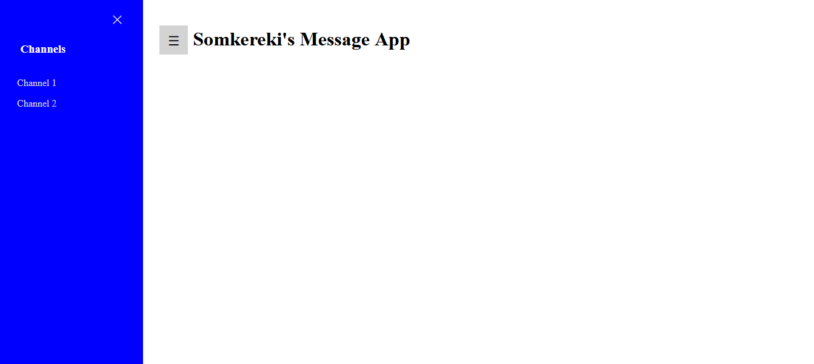
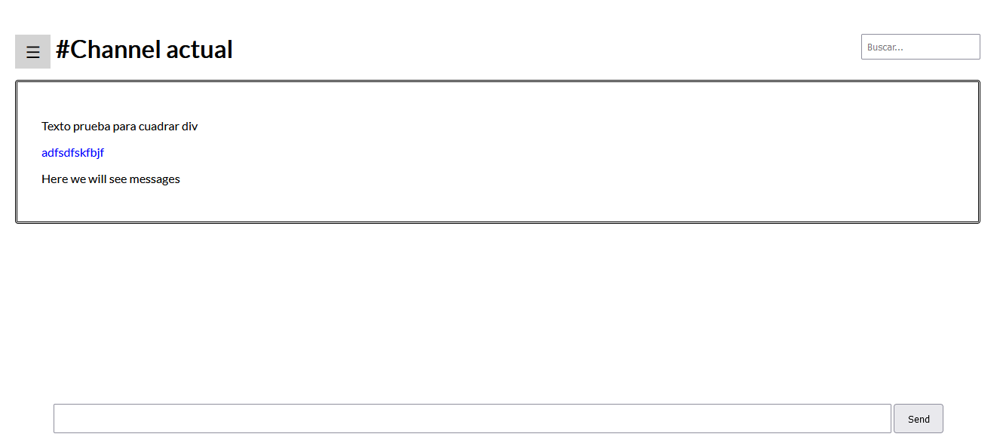
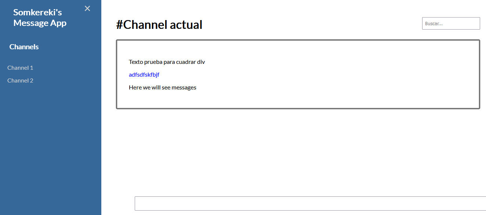

# Reto-App-Mensajeria
 Reto final Programacion desde Cero GeeksHubs Academy

## Objetivos de la app:
1. Los usuarios pueden crear channels de comunicación
2. Los usuarios deben poder escribir mensajes en los canales creados
3. Los canales y las conversaciones tienen que tener histórico scrollable hacia atrás en el tiempo.
4. Los mensajes tienen que mostrar la fecha y hora en la que se crearon
5. Los usuarios tienen que poder buscar entre todos los mensajes de todos los canales en un buscador global

Tips para crear canales:
 - Canales guardados en array
 - botón onclick para crear canal (crear input para nombre del canal y botón guardar)

 Tips para mensajes:
  - Barra de input para escribir mensaje y gurdarlo en pantalla con fecha y hora asociados
  - Guardar en histórico de mensajes (archivo por cada canal?? / array ordenado)
  - Los mensajes deben tener orden por fecha y hora dentro de un mismo canal
  - Contenedor de los mensajes scrollable (comprobar overflow)
  - Crear input buscador entre los mensajes de un canal (búsqueda de términos dentro de un array)

Se valorará:
 - Buen naming en las variables
 - Aplicación de buenas prácticas como reutilización de funciones
 - Adaptación responsive para que se visualice todo correctamentes en todos los dispositivos

## Funcionalidad

## Progreso del desarrollo:

 Rama "develop": servirá para mantener la estructura central de la app, sin llegar a usar la rama main.

Nueva rama para estructura de la página: WIP-main-structure (desde develop)
Aquí se creará la estructura de la página antes de darle funcionalidad ni demasiada estética para asentar las bases de los objetivos a cumplir.

Comprobación del intento de adjuntar imágenes como proceso del desarrollo:

Después de llegar a este punto, se han hecho varios cambios para organizar mejor la app. En primer lugar, se ha movido el título de la app en el sideBar, para que arriba aparezca el título del canal correspondiente.

También se ha añadido un recuadro para visualizar el contenido donde estarán los mensajes y una barra input con un botón enviar para escribir el mensaje en el recuadro correspondiente. El mensaje lleva color azul para comprobar que aparece de forma correcta.

Adjunto imagen para observar la estructura principal hasta este momento:

Al realizar la captura de pantalla de la estructura principal se encuentra un fallo, la barra inferior de input no se acorta al abrir el sidebar. Adjunto de nuevo imagen:

Para areglarlo abro rama _hotfix_ desde _WIP-main-structure_.

Al no conseguir nada de lo propuesto, se deja para otra ocasión y se hace merge a _WIP-main-structure_ para seguir con el trabajo.

Creamos nueva rama _message-system_ para crear la estructura correcta de los mensajes.